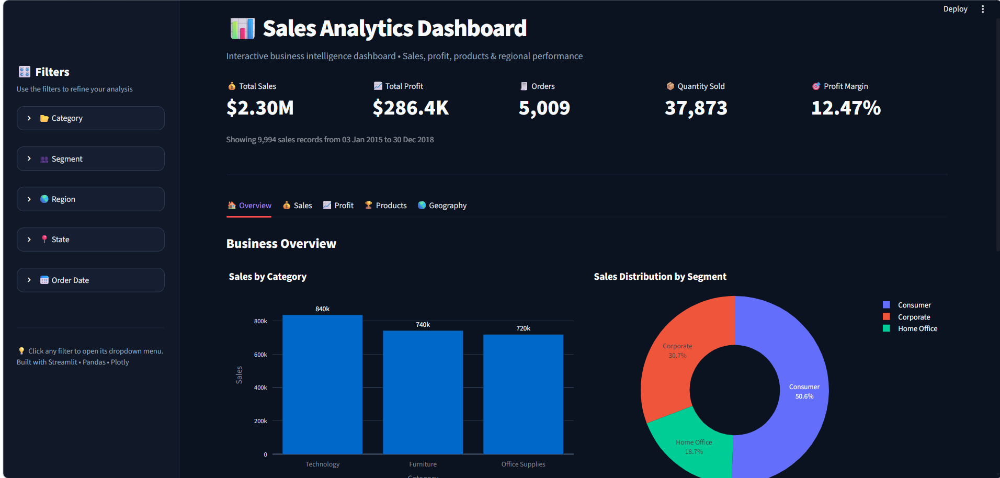
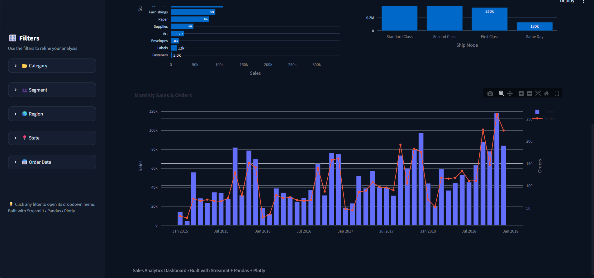
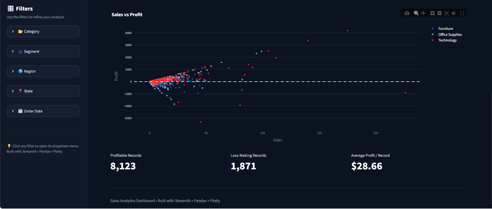
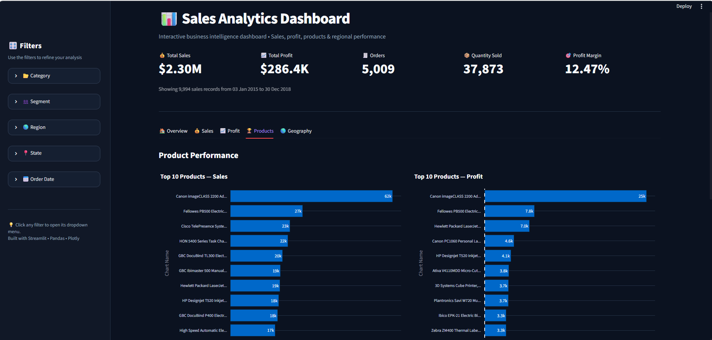
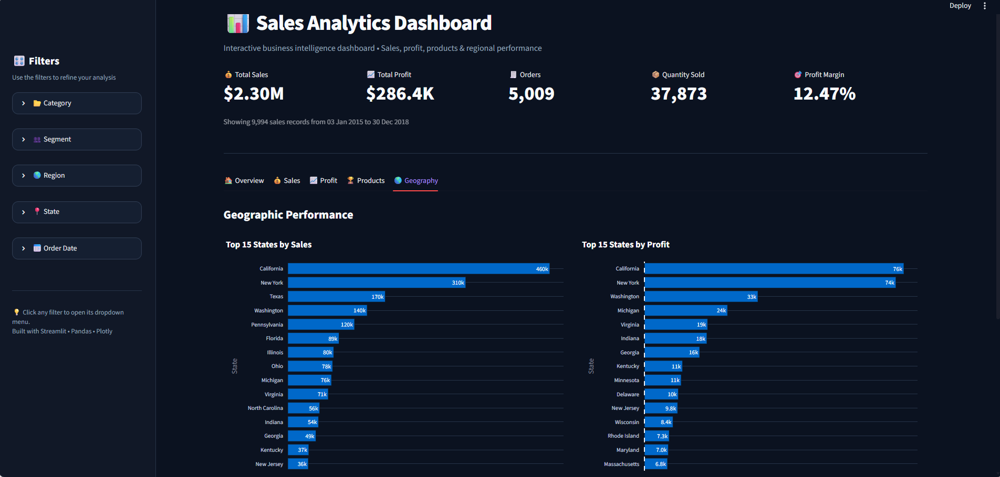

# Sales Analytics Dashboard

An interactive **Sales Analytics Dashboard** built using **Python, Pandas, Plotly, and Streamlit** to analyze sales, profit, products, customer segments, and geographical performance.

This project follows a complete data analysis workflow including **data loading, data understanding, data cleaning, exploratory data analysis (EDA), data visualization, and interactive dashboard development**.

---

## Live Dashboard

🔗 **Live Demo:** [Sales Analytics Dashboard](https://sales-data-analysis-dashboard-bylakshmi.streamlit.app/)

---

## Project Overview

The **Sales Analytics Dashboard** transforms raw sales data into meaningful and actionable business insights through interactive KPIs, charts, filters, and tables.

The dashboard allows users to analyze business performance based on:

-  Category
-  Segment
-  Region
-  State
-  Order Date

All KPIs and visualizations dynamically update according to the selected filters.

---

##  Project Objectives

The main objectives of this project are:

- Understand the structure of the sales dataset
- Check missing values and duplicate records
- Perform data cleaning and preprocessing
- Convert columns into appropriate data types
- Analyze overall sales performance
- Analyze overall profit performance
- Identify top-performing products
- Analyze category and sub-category performance
- Compare customer segments
- Analyze state and regional performance
- Study monthly sales trends
- Study monthly profit trends
- Compare sales and profit
- Identify profitable and loss-making records
- Build an interactive business intelligence dashboard

---

# 📂 Dataset

This project uses the **Superstore Sales Dataset**.

### Dataset Size

- **Rows:** 9,994
- **Columns:** 21

### Dataset Columns

| Column | Description |
|---|---|
| Row ID | Unique row identifier |
| Order ID | Unique order identifier |
| Order Date | Date when the order was placed |
| Ship Date | Date when the order was shipped |
| Ship Mode | Shipping method |
| Customer ID | Unique customer identifier |
| Customer Name | Customer name |
| Segment | Customer segment |
| Country | Country of the customer |
| City | Customer city |
| State | Customer state |
| Postal Code | Postal code |
| Region | Geographical region |
| Product ID | Unique product identifier |
| Category | Product category |
| Sub-Category | Product sub-category |
| Product Name | Name of the product |
| Sales | Sales amount |
| Quantity | Quantity sold |
| Discount | Discount applied |
| Profit | Profit generated |

---

#  Technologies Used

| Technology | Purpose |
|---|---|
|  Python | Programming and data analysis |
|  Pandas | Data manipulation and analysis |
|  Plotly | Interactive visualizations |
|  Streamlit | Interactive dashboard development |
|  Matplotlib | Data visualization |
|  Seaborn | Statistical visualization |
|  Git | Version control |
|  GitHub | Project hosting |

---

# 🗂️ Project Structure

```text
Sales-Data-Analysis/
│
├── app.py
├── main.py
├── Superstore.csv
│
├── data_loader.py
├── data_understanding.py
├── data_cleaning.py
├── eda_analysis.py
├── data_visualization.py
│
├── dashboard_overview.png
├── sales_analysis.png
├── profit_analysis.png
├── product_analysis.png
├── geographic_analysis.png
│
└── README.md
```

> The dashboard screenshots are stored directly in the root directory of the repository.

---

#  Project Workflow

```text
                    Superstore.csv
                          │
                          ▼
                    Data Loading
                          │
                          ▼
                 Data Understanding
                          │
                          ▼
                    Data Cleaning
                          │
                          ▼
            Exploratory Data Analysis
                          │
                          ▼
                 Data Visualization
                          │
                          ▼
            Interactive Streamlit App
                          │
                          ▼
               Business Insights
```

---

#  1. Data Loading

The dataset is loaded using **Pandas**.

The `data_loader.py` module contains a reusable function for loading the CSV dataset.

```python
import pandas as pd

def load_data(path):
    try:
        df = pd.read_csv(path)
        print("Dataset loaded successfully.")
        return df

    except FileNotFoundError:
        print("Dataset not found.")
        return None
```

---

#  2. Data Understanding

The project performs several data understanding operations before analysis.

### Dataset Shape

The dataset contains:

```text
Rows    : 9,994
Columns : 21
```

### Column Names

All column names are checked to understand the available features.

### Data Types

The data types of all columns are examined.

### Dataset Information

`df.info()` is used to understand:

- Number of records
- Non-null values
- Data types
- Memory usage

### Statistical Summary

The project uses:

```python
df.describe()
```

to generate a statistical summary of numerical columns.

### Missing Values

Missing values are checked using:

```python
df.isnull().sum()
```

### Duplicate Records

Duplicate rows are checked using:

```python
df.duplicated().sum()
```

---

#  3. Data Cleaning

The `data_cleaning.py` module handles data preprocessing.

## Missing Values

Missing values are identified and can be removed when required.

```python
df.dropna()
```

## Duplicate Records

Duplicate rows can be removed using:

```python
df.drop_duplicates()
```

## Data Type Conversion

The date columns are converted into datetime format.

```python
df["Order Date"] = pd.to_datetime(
    df["Order Date"],
    format="mixed"
)

df["Ship Date"] = pd.to_datetime(
    df["Ship Date"],
    format="mixed"
)
```

The `Postal Code` column is converted to string:

```python
df["Postal Code"] = df["Postal Code"].astype(str)
```

---

#  4. Exploratory Data Analysis

The `eda_analysis.py` module performs different business analyses.

---

##  Sales Summary

The project calculates:

- Total Sales
- Average Sales
- Highest Sale
- Lowest Sale

```python
total_sales = df["Sales"].sum()
average_sales = df["Sales"].mean()
highest_sales = df["Sales"].max()
lowest_sales = df["Sales"].min()
```

---

##  Sales by Category

Sales are analyzed across the major product categories:

- Technology
- Furniture
- Office Supplies

---

##  Sales by Sub-Category

Sales performance is analyzed across different sub-categories.

Examples include:

- Phones
- Chairs
- Storage
- Tables
- Binders
- Paper
- Appliances
- Accessories
- Furnishings
- Art
- Envelopes
- Labels
- Fasteners
- Supplies

---

##  Top Selling Products

The project identifies the **Top 10 Products by Sales** by grouping products and sorting them according to total sales.

---

##  Sales by Segment

Sales are analyzed across:

- Consumer
- Corporate
- Home Office

---

##  Sales by State

The project identifies the top-performing states based on total sales.

---

#  Profit Analysis

The project also performs detailed profitability analysis.

## Profit Summary

The following metrics are calculated:

- Total Profit
- Average Profit
- Highest Profit
- Lowest Profit

---

##  Profit by Category

Profit is analyzed across:

- Technology
- Furniture
- Office Supplies

---

##  Profit by State

States are ranked according to total profit generated.

---

##  Top Profitable Products

The project identifies the **Top 10 Products by Profit**.

---

##  Monthly Sales

Sales are grouped by month using the `Order Date` column to identify sales trends over time.

---

##  Sales vs Profit

Sales and profit are compared to understand the relationship between revenue and profitability.

Each record is categorized as:

```text
Profit
Loss
```

based on the profit value.

---

#  5. Data Visualization

The project uses interactive charts to make business insights easier to understand.

### Sales Visualizations

-  Sales by Category
-  Sales by Sub-Category
-  Monthly Sales Trend
-  Sales Distribution by Segment
-  Sales by Ship Mode

### Profit Visualizations

-  Profit by Category
-  Profit by Sub-Category
-  Top Products by Profit
-  Monthly Profit Trend
-  Sales vs Profit

### Product Visualizations

-  Top 10 Products by Sales
-  Top 10 Products by Profit
-  Product Performance Table

### Geographic Visualizations

-  Top States by Sales
-  Top States by Profit
-  Regional Performance

---

#  Interactive Streamlit Dashboard

The Python analysis was transformed into an interactive **Streamlit dashboard**.

The dashboard contains five major sections:

```text
 Overview
 Sales
 Profit
 Products
 Geography
```

---

#  Dashboard KPIs

The dashboard displays important business performance indicators.

###  Total Sales

Total revenue generated from the selected records.

###  Total Profit

Total profit generated from the selected records.

###  Orders

Number of unique orders.

###  Quantity Sold

Total quantity of products sold.

###  Profit Margin

Profit margin is calculated as:

```text
Profit Margin = Total Profit / Total Sales × 100
```

---

#  Interactive Filters

The dashboard provides dynamic filters for:

###  Category

Filter the analysis based on product category.

###  Segment

Filter the analysis based on customer segment.

###  Region

Analyze business performance across different regions.

###  State

Analyze state-level sales and profit.

###  Order Date

Select a custom date range for time-based analysis.

---

#  Dashboard Overview

The Overview section provides a high-level summary of the business.

It includes:

- KPI cards
- Sales by Category
- Sales Distribution by Segment
- Monthly Sales Trend
- Monthly Profit Trend
- Quick Business Insights

### Screenshot



---

#  Sales Analysis

The Sales section focuses on revenue performance.

It includes:

- Sales by Category
- Sales by Sub-Category
- Sales by Segment
- Sales by Ship Mode
- Monthly Sales
- Order Trends

### Screenshot



---

#  Profit Analysis

The Profit section focuses on profitability.

It includes:

- Profit by Category
- Profit by Sub-Category
- Top Products by Profit
- Sales vs Profit
- Profitable Records
- Loss-Making Records
- Average Profit per Record
- Monthly Profit Trend

### Screenshot



---

#  Product Analysis

The Product section focuses on product-level performance.

It includes:

- Top 10 Products by Sales
- Top 10 Products by Profit
- Product Performance Table
- Sales and Profit comparison

### Screenshot



---

#  Geographic Analysis

The Geography section focuses on geographical business performance.

It includes:

- Top States by Sales
- Top States by Profit
- Regional Performance
- State-level comparison

### Screenshot



---

#  Key Business Insights

The dashboard can be used to identify important business patterns such as:

- Which product category generates the highest sales
- Which category generates the highest profit
- Which sub-category performs best
- Which products are the top sellers
- Which products generate the highest profit
- Which customer segment contributes the most revenue
- Which states generate the highest sales
- Which states generate the highest profit
- How sales change over time
- How profit changes over time
- Which records are profitable
- Which records generate losses

---

#  Business Questions Answered

This project helps answer important business questions such as:

1. What is the total sales generated?
2. What is the total profit?
3. Which category generates the highest sales?
4. Which category generates the highest profit?
5. Which sub-category performs the best?
6. Which products have the highest sales?
7. Which products generate the highest profit?
8. Which customer segment contributes the most sales?
9. Which states generate the highest sales?
10. Which states generate the highest profit?
11. How do sales change over time?
12. How does profit change over time?
13. Which records are profitable?
14. Which records are loss-making?
15. What is the average profit per record?

---

#  Installation

## 1. Clone the Repository

```bash
git clone https://github.com/lakshmi1810-create/Sales-Data-Analysis.git
```

---

## 2. Navigate to the Project Directory

```bash
cd Sales-Data-Analysis
```

---

## 3. Create a Virtual Environment

### Windows

```bash
python -m venv venv
venv\Scripts\activate
```

### macOS / Linux

```bash
python3 -m venv venv
source venv/bin/activate
```

---

## 4. Install Dependencies

```bash
pip install pandas matplotlib seaborn plotly streamlit
```

---

#  Run the Project

## Run the Python CLI Version

The project includes a modular command-line analysis system.

Run:

```bash
python main.py
```

The CLI provides:

```text
=========================================
        SALES DATA ANALYSIS
=========================================

1. Data Understanding
2. Data Cleaning
3. EDA Analysis
4. Visualization
5. Exit
```

---

## Run the Streamlit Dashboard

Run:

```bash
streamlit run app.py
```

The dashboard will open in your default web browser.

---

#  Dependencies

The main Python libraries used in this project are:

```text
pandas
matplotlib
seaborn
plotly
streamlit
```

---

#  Skills Demonstrated

This project demonstrates practical knowledge of:

-  Python Programming
-  Pandas
-  Data Cleaning
-  Data Preprocessing
-  Exploratory Data Analysis
-  Data Visualization
-  Plotly
-  Streamlit
-  KPI Development
-  Business Analytics
-  Dashboard Development
-  Trend Analysis
-  Geographic Analysis
-  Product Performance Analysis
-  Git
-  GitHub

---

#  Project Highlights

 Modular Python project structure

 Interactive Streamlit dashboard

 Dynamic filters

 KPI cards

 Interactive Plotly charts

 Sales analysis

 Profit analysis

 Product performance analysis

 Customer segment analysis

 Geographic analysis

 Monthly sales and profit trends

 Sales vs Profit analysis

 Top products analysis

 State-wise performance analysis

 Quick business insights

 Professional dark-themed dashboard UI

---

#  Future Improvements

The project can be further enhanced with:

-  Customer-level analysis
-  Customer retention analysis
-  RFM customer segmentation
-  Sales forecasting
-  Machine Learning based prediction
-  Advanced geographical maps
-  Downloadable filtered reports
-  Automated business reports
-  Automated business recommendations
-  Advanced forecasting models
-  Database integration

---

#  Learning Outcomes

Through this project, I gained practical experience in:

- Loading and exploring real-world datasets
- Cleaning and preprocessing data
- Handling missing values and duplicates
- Working with datetime data
- Performing GroupBy analysis
- Creating business KPIs
- Performing exploratory data analysis
- Building interactive visualizations
- Developing Streamlit dashboards
- Creating modular Python applications
- Organizing projects for GitHub
- Presenting data-driven business insights

---

#  Author

## Lakshmi Chauhan

**Aspiring Data Analyst**

### Skills

- Python
- SQL
- Pandas
- Data Analysis
- Data Visualization
- Streamlit
- Plotly
- Business Intelligence

---

#  Support

If you found this project useful or interesting, consider giving the repository a ⭐ on GitHub.

Your support is appreciated! 

---

#  License

This project is created for **educational and portfolio purposes**.
